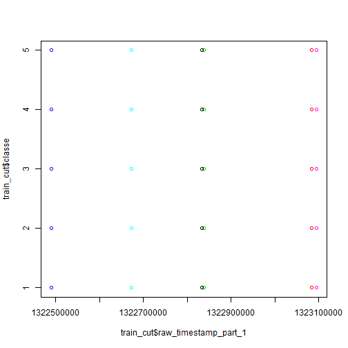
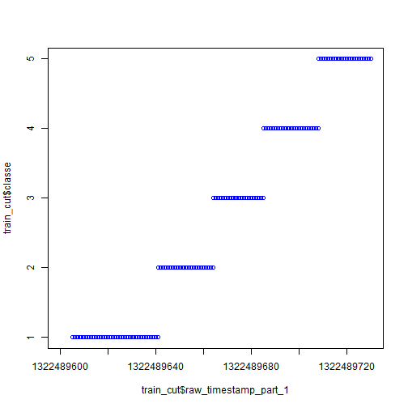
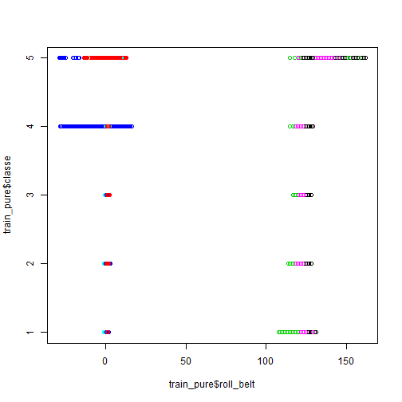

Machine Learning Course Project
===============================

The goal of this course project is to predict the manner in which people did the dumbbell lifting exercise based on measurements made by wearable sensors. There are five possible options - normal execution and four types of incorrect execution (throwing the elbows to the front, lifting the dumbbell only halfway, lowering the dumbbell only halfway and throwing the hips to the front).

First, we need to load livraries, download and read the data.


```r
library(caret)

download.file("https://d396qusza40orc.cloudfront.net/predmachlearn/pml-training.csv", "pml-training.csv")
download.file("https://d396qusza40orc.cloudfront.net/predmachlearn/pml-testing.csv", "pml-testing.csv")

pml_train <-read.csv("pml-training.csv")
pml_test <- read.csv("pml-testing.csv")
```

Data processing
===============

If we look at the data, we can see that there are 100 variables that have meaningful values (not NA) only for new windows. Since they represent only small fractions of the training dataset, and they are NA in the testing dataset, we don't need them.


```r
features <- names(pml_train_nw)

match1 <- grep("kurtosis_", features)
match2 <- grep("skewness_", features)
match3 <- grep("max_", features)
match4 <- grep("min_", features)
match5 <- grep("amplitude_", features)
match6 <- grep("var_", features)
match7 <- grep("avg_", features)
match8 <- grep("stddev_", features)

drop <- c(match1, match2, match3, match4, match5, match6, match7, match8)
pml_train_new <- <- pml_train[, -drop]
```

Now we should undergo standard partitioning procedures, in order to make cross validation after the training and compare in-sample and out-of-sample errors. In addition, I dropped X that is a mere observation identifier.


```r
set.seed(98765)
in_train <- createDataPartition(y=pml_train_new$classe, p=0.75, list=FALSE)
train <- pml_train_new[in_train, ]
test <- pml_train_new[-inTrain, ]

train_cut <- train[, -1]
test_cut <- test[, -1]
```

No additional preprocessing as scaling, box-cox transformation etc was needed, since the model performed exceptionally good anyway.

Training
========

First, I tried usual decision tree (CART).


```r
fit_rpart <- train(classe~., data=train_cut, method="rpart")
save(fit_rpart, file="fit_rpart.Rdata")
```

However, it's accuracy was not very high


```r
load(file="fit_rpart.Rdata")
```

```
## Warning in readChar(con, 5L, useBytes = TRUE): cannot open compressed file
## 'fit_rpart.Rdata', probable reason 'No such file or directory'
```

```
## Error in readChar(con, 5L, useBytes = TRUE): cannot open the connection
```

```r
fit_rpart
```

```
## CART 
## 
## 14718 samples
##    58 predictor
##     5 classes: 'A', 'B', 'C', 'D', 'E' 
## 
## No pre-processing
## Resampling: Bootstrapped (25 reps) 
## 
## Summary of sample sizes: 14718, 14718, 14718, 14718, 14718, 14718, ... 
## 
## Resampling results across tuning parameters:
## 
##   cp          Accuracy   Kappa       Accuracy SD  Kappa SD  
##   0.03996962  0.5009046  0.34626448  0.09719707   0.15213523
##   0.04579259  0.4026327  0.18914303  0.06161906   0.10854821
##   0.11516187  0.3360041  0.07830238  0.03970398   0.05999043
## 
## Accuracy was used to select the optimal model using  the largest value.
## The final value used for the model was cp = 0.03996962.
```

If we look at confusion matrices, we can see a lot of errors. Moreover, the method does not identify class "D" at all.


```r
rpart_train <- predict(fit_rpart, newdata=train_cut)
rpart_test <- predict(fit_rpart, newdata=test_cut)

table(rpart_train, train_cut$classe)
```

```
##            
## rpart_train    A    B    C    D    E
##           A 2793  304    5    0    0
##           B  657 1153  387  849  216
##           C  728 1391 2175 1563 1270
##           D    0    0    0    0    0
##           E    7    0    0    0 1220
```

```r
table(rpart_test, test_cut$classe)
```

```
##           
## rpart_test    A    B    C    D    E
##          A 3575  393    6    0    0
##          B  800 1536  513 1115  288
##          C  940 1868 2903 2101 1688
##          D    0    0    0    0    0
##          E   14    0    0    0 1631
```

If one tree is not enough, let's plant a forest then.


```r
fit_rf <- train(classe~., data=train_cut, method="rf")
save(fit_rf, file="fit_rf.Rdata")
```

One can see that the accuracy is very high.


```r
load(file="fit_rf.Rdata")
```

```
## Warning in readChar(con, 5L, useBytes = TRUE): cannot open compressed file
## 'fit_rf.Rdata', probable reason 'No such file or directory'
```

```
## Error in readChar(con, 5L, useBytes = TRUE): cannot open the connection
```

```r
fit_rf
```

```
## Random Forest 
## 
## 14718 samples
##    58 predictor
##     5 classes: 'A', 'B', 'C', 'D', 'E' 
## 
## No pre-processing
## Resampling: Bootstrapped (25 reps) 
## 
## Summary of sample sizes: 14718, 14718, 14718, 14718, 14718, 14718, ... 
## 
## Resampling results across tuning parameters:
## 
##   mtry  Accuracy   Kappa      Accuracy SD  Kappa SD   
##    2    0.9879139  0.9847026  0.001827021  0.002309473
##   41    0.9981573  0.9976685  0.000872114  0.001103404
##   80    0.9973084  0.9965940  0.001013311  0.001281616
## 
## Accuracy was used to select the optimal model using  the largest value.
## The final value used for the model was mtry = 41.
```

It is even higher if we look at confusion matrices. There are no errors at all, for both training and testing datasets. 


```r
rf_train <- predict(fit_rf, newdata=train_cut)
rf_test <- predict(fit_rf, newdata=test_cut)

table(rf_train, train_cut$classe)
```

```
##         
## rf_train    A    B    C    D    E
##        A 4185    0    0    0    0
##        B    0 2848    0    0    0
##        C    0    0 2567    0    0
##        D    0    0    0 2412    0
##        E    0    0    0    0 2706
```

```r
table(rf_test, test_cut$classe)
```

```
##        
## rf_test    A    B    C    D    E
##       A 5329    0    0    0    0
##       B    0 3797    0    0    0
##       C    0    0 3422    1    0
##       D    0    0    0 3215    0
##       E    0    0    0    0 3607
```

Interpretation
==============

This 100% accuracy looks suspicious. Let's see which features are the most important.


```r
library(caret)
varImp(fit_rf)
```

```
## rf variable importance
## 
##   only 20 most important variables shown (out of 80)
## 
##                                Overall
## raw_timestamp_part_1           100.000
## num_window                      46.626
## roll_belt                       42.993
## pitch_forearm                   27.797
## magnet_dumbbell_z               17.614
## magnet_dumbbell_y               13.808
## yaw_belt                        12.647
## roll_forearm                    12.185
## pitch_belt                      12.110
## cvtd_timestamp30/11/2011 17:12  10.165
## cvtd_timestamp02/12/2011 14:58   9.440
## magnet_dumbbell_x                7.617
## cvtd_timestamp28/11/2011 14:15   7.441
## cvtd_timestamp02/12/2011 13:33   7.347
## accel_belt_z                     5.983
## roll_dumbbell                    5.801
## accel_dumbbell_y                 5.468
## magnet_belt_y                    5.460
## cvtd_timestamp05/12/2011 11:24   5.437
## accel_forearm_x                  5.309
```

My guess is that timestamp variable is a cheat, since it serves as an identifier like the X variable that I dropped. We could try to check this with plots. Initial general plot does not proof anything.


```r
plot(train_cut$raw_timestamp_part_1, train_cut$classe, col=train_cut$user)
```

 

However, after some fine tuning of horizontal axis scale, we can see that it is really the case. (Below you can see only one range, but other ranges look exactly like this one).


```r
plot(train_cut$raw_timestamp_part_1, train_cut$classe, xlim=c(1322489600,1322489730), col=train_cut$user)
```

 

Obviously, each person made each exercise consequently, which makes the task just pure learning exercise (with the only question left, why decision tree performed so poorly). In case of real life problem, we will deal only with measurements.

Pure calculation
================

Let's check how our models perform if we drop all time stamps and other variables that can easily identify sequence (like window numbers). Let's even drop user identification.


```r
train_pure <-train_cut[, -(1:6)]
set.seed(34567)
fit_pure <- train(classe~., data=train_pure, method="rf")
save(fit_pure, file="fit_pure.Rdata")
```

Accuracy is still very good.


```r
load(file="fit_pure.Rdata")
```

```
## Warning in readChar(con, 5L, useBytes = TRUE): cannot open compressed file
## 'fit_pure.Rdata', probable reason 'No such file or directory'
```

```
## Error in readChar(con, 5L, useBytes = TRUE): cannot open the connection
```

```r
fit_pure
```

```
## Random Forest 
## 
## 14718 samples
##    52 predictor
##     5 classes: 'A', 'B', 'C', 'D', 'E' 
## 
## No pre-processing
## Resampling: Bootstrapped (25 reps) 
## 
## Summary of sample sizes: 14718, 14718, 14718, 14718, 14718, 14718, ... 
## 
## Resampling results across tuning parameters:
## 
##   mtry  Accuracy   Kappa      Accuracy SD  Kappa SD   
##    2    0.9892646  0.9864200  0.001895716  0.002403917
##   27    0.9886442  0.9856351  0.002360701  0.002994442
##   52    0.9799837  0.9746795  0.004765243  0.006037212
## 
## Accuracy was used to select the optimal model using  the largest value.
## The final value used for the model was mtry = 2.
```

However, there some out-of-sample errors, but error rate is very small. In fact, only a few observations (out of 19371) very classified incorrectly.


```r
pure_train <- predict(fit_pure, newdata=train_cut)
pure_test <- predict(fit_pure, newdata=test_cut)

table(pure_train, train_cut$classe)
```

```
##           
## pure_train    A    B    C    D    E
##          A 4185    0    0    0    0
##          B    0 2848    0    0    0
##          C    0    0 2567    0    0
##          D    0    0    0 2412    0
##          E    0    0    0    0 2706
```

```r
table(pure_test, test_cut$classe)
```

```
##          
## pure_test    A    B    C    D    E
##         A 5329    7    0    0    0
##         B    0 3790    5    0    0
##         C    0    0 3416   15    0
##         D    0    0    1 3200    1
##         E    0    0    0    1 3606
```

Finally, let's look at variable importance.


```r
varImp(fit_pure)
```

```
## rf variable importance
## 
##   only 20 most important variables shown (out of 52)
## 
##                      Overall
## roll_belt             100.00
## yaw_belt               82.12
## magnet_dumbbell_z      70.45
## pitch_forearm          66.74
## magnet_dumbbell_y      65.19
## pitch_belt             61.50
## roll_forearm           57.93
## magnet_dumbbell_x      54.86
## magnet_belt_z          46.66
## accel_dumbbell_y       46.47
## roll_dumbbell          45.73
## accel_belt_z           45.46
## magnet_belt_y          42.77
## accel_dumbbell_z       38.50
## roll_arm               36.02
## accel_forearm_x        34.15
## gyros_belt_z           31.50
## total_accel_dumbbell   30.55
## yaw_dumbbell           28.87
## accel_dumbbell_x       28.75
```

Let's check the top feature like we did last time with time stamp.


```r
plot(train_pure$roll_belt, train_pure$classe, col=train_cut$user)
```

 

Here we see not obvious relationship. Moreover, importance is rather high for some other variables too, which means that here the model indeed classifies exercise execution on the basis of different measurements made by sensors.

Rereferences
============
Ugulino, W.; Cardador, D.; Vega, K.; Velloso, E.; Milidiu, R.; Fuks, H. Wearable Computing: Accelerometers' Data Classification of Body Postures and Movements. Proceedings of 21st Brazilian Symposium on Artificial Intelligence. Advances in Artificial Intelligence - SBIA 2012. In: Lecture Notes in Computer Science. , pp. 52-61. Curitiba, PR: Springer Berlin / Heidelberg, 2012. ISBN 978-3-642-34458-9. DOI: 10.1007/978-3-642-34459-6_6.
